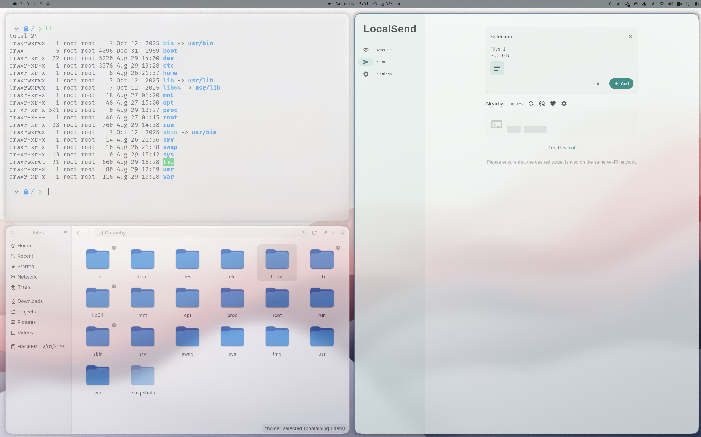

# Glass White

The light companion to [Glass Black](https://github.com/osungjinwoo/omarchy-glass-black): an [Omarchy](https://omarchy.org) theme built to feel like iOS's Control Center — real frosted glass, not just a blurred rectangle. Uses the [hyprglass](https://github.com/hyprnux/hyprglass) plugin for actual refraction — chromatic aberration, fresnel edge highlighting, specular reflections and lens distortion on window borders — with every tone-mapping knob pinned back to neutral so whatever's behind the glass shows through in its true color, just blurred.



## Highlights

- Base palette straight from iOS system colors (`#FF3B30` red, `#007AFF` blue, `#34C759` green, etc.) on a `#F2F2F7` near-white background
- 20px rounded corners with high rounding power for that iOS-widget curve, soft drop shadows
- Translucent bar, launcher, notifications, lock screen, and popups all matched to the same glass material with native Hyprland layer blur as a fallback if the plugin isn't loaded
- Animated gradient border on the active window (`#3e6b96` → `#6b9bc7` at 45°)

## Requirements

The glass/refraction effect on window borders needs the [hyprglass](https://github.com/hyprnux/hyprglass) Hyprland plugin, on top of the `.git`-removal step described under Install below. Install the plugin separately, once, via `hyprpm`:

```
hyprpm add https://github.com/hyprnux/hyprglass
hyprpm enable hyprglass
hyprpm reload
```

Without it, you still get this theme's rounding, opacity, and native Hyprland layer blur on the bar/menus/notifications — you just lose the refraction/chromatic-aberration effect on window borders.

## Wallpaper

One wallpaper is bundled in `backgrounds/`: a generic "abstract grainy texture" JPEG whose original source page couldn't be traced. If this is yours and you'd rather it not be here, open an issue.

## Install

```
omarchy-theme-install https://github.com/osungjinwoo/omarchy-glass-white
```

(Or via the Omarchy menu: `Super + Space` → *Install > Style > Theme* → paste this repo's URL.)

This gets you the color palette and translucent bar/menu/notifications right away. It will **not** get you the glass effect or the terminal colors yet — Omarchy refuses to apply `.lua` or terminal-config files from a theme it just git-cloned (they can run code), so `hyprland.lua` and `foot.ini` are silently replaced with generic, recolored versions.

To unlock the real thing, remove the one thing that makes Omarchy treat the install as "untrusted": the leftover `.git` directory from the clone.

```
rm -rf ~/.config/omarchy/themes/glass-white/.git
omarchy-theme-set glass-white
```

(Or delete `.git` first, then just reselect the theme from the Omarchy menu.) From then on this theme's actual `hyprland.lua` — hyprglass config, rounding, blur — and `foot.ini` apply exactly as shipped in this repo.
